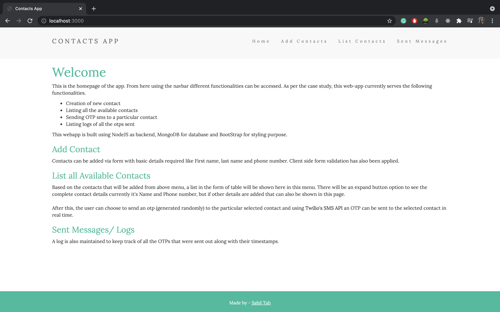
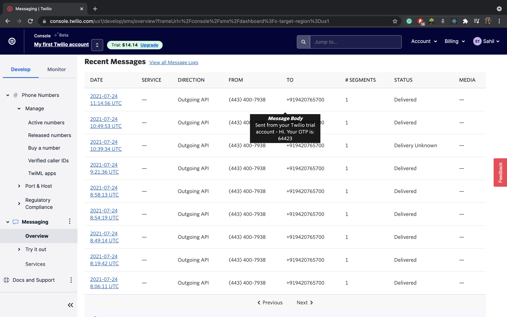
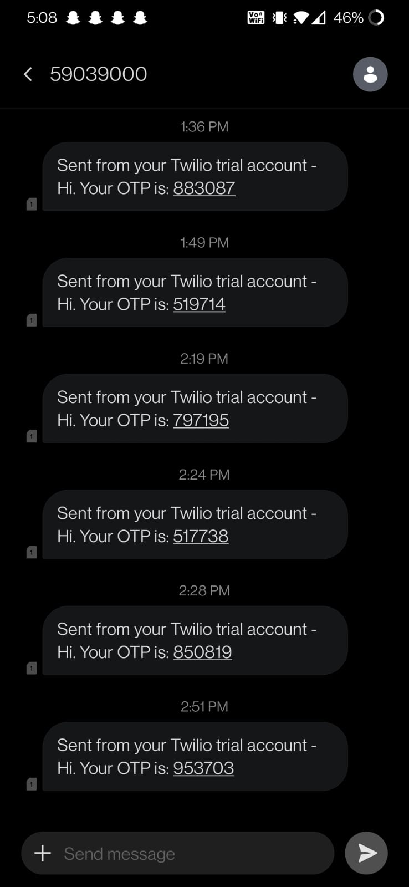

# contacts-app-nodejs 💬
Solution for a case study to implement a simple contacts app which can send OTP to available contacts. Here, I used:

* Backend using NodeJS
* MongoDB for database
* BootStrap for frontend
* Twilio SMS API 

This API was used for sending text message to a phone number. In trail account, sms can be sent only to a single registered number.

### NPM Libraries
* Express
* Mongoose
* EJS
* Dotenv
* Twilio


## For Running the Project

Download node_modules/ first
```
npm i
```

After that, create a ```.env``` file and add your own API and token values from Twilio's dashboard
```
TWILIO_ACCOUNT_SID=
TWILIO_AUTH_TOKEN=
TWILIO_FROM_NUM=
MONGO_ATLAS_PATH=
```

If you don't plan on using MongoDB Atlas, use the localhost address
```
mongodb://localhost:27017/contactsDB
```

After this, simply run
```
nodemon app.js
```

or (in case you don't have nodemon)
```
node app.js
```


## Screenshot
#### Homepage of the app



#### Twilio Dashboard



#### Preview



